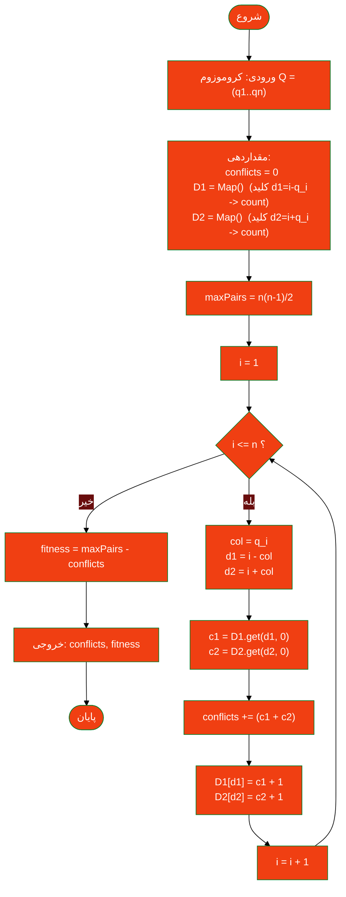

```mermaid
---
config:
  theme: 'base'
  themeVariables:
    primaryColor: '#f03f12ff'
    primaryTextColor: '#ffffffff'
    primaryBorderColor: '#007c29ff'
    lineColor: '#000000ff'
    secondaryColor: '#690d0dff'
    tertiaryColor: '#000000ff'
---
flowchart TD
  A([شروع]) --> B["ورودی: کروموزوم Q = (q1..qn)"]

  B --> C["مقداردهی:
  conflicts = 0
  D1 = Map()  (کلید d1=i-q_i -> count)
  D2 = Map()  (کلید d2=i+q_i -> count)"]

  C --> D["maxPairs = n(n-1)/2"]
  D --> E["i = 1"]
  E --> F{"i <= n ؟"}

  F -->|خیر| K["fitness = maxPairs - conflicts"]
  K --> L["خروجی: conflicts, fitness"]
  L --> M([پایان])

  F -->|بله| G["col = q_i
  d1 = i - col
  d2 = i + col"]

  G --> H["c1 = D1.get(d1, 0)
  c2 = D2.get(d2, 0)"]

  H --> I["conflicts += (c1 + c2)"]
  I --> J["D1[d1] = c1 + 1
  D2[d2] = c2 + 1"]

  J --> N["i = i + 1"] --> F
```
