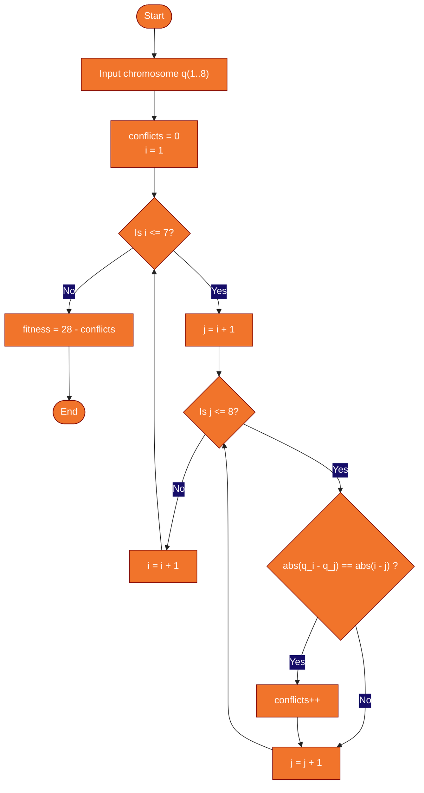

```mermaid
---
config:
  theme: 'base'
  themeVariables:
    primaryColor: '#f1742bff'
    primaryTextColor: '#ffffffff'
    primaryBorderColor: '#7C0000'
    lineColor: '#222222ff'
    secondaryColor: '#160d69ff'
    tertiaryColor: '#000000ff'
---
flowchart TD
  A([Start]) --> B["Input chromosome q(1..8)"]
  B --> C["conflicts = 0<br/>i = 1"]
  C --> D{Is i <= 7?}
  D -- No --> H["fitness = 28 - conflicts"] --> I([End])
  D -- Yes --> E["j = i + 1"]
  E --> F{Is j <= 8?}
  F -- No --> G["i = i + 1"] --> D
  F -- Yes --> J{"abs(q_i - q_j) == abs(i - j) ?"}
  J -- Yes --> K["conflicts++"]
  J -- No --> L["j = j + 1"]
  K --> L
  L --> F
```
